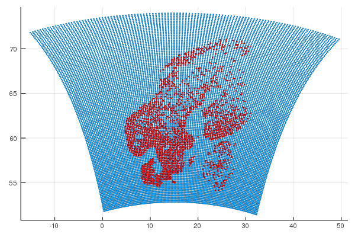

# Netatmo

## Obtaining the source 

```bash
git clone https://github.com/roelstappers/Netatmo.jl.git Netatmo
```

## Usage 

Create a file `Netatmo/src/config/$HOSTNAME.json` e.g. for PPI `xvis-m3a.json`

```json
{
    "CSV_ARCHIVE": "/lustre/storeB/users/roels/Netatmo",
    "JSON_ARCHIVE": "/lustre/storeB/project/metproduction/products/netatmo/",
    "OBSOUL_ARCHIVE": "/lustre/storeB/users/roels/OBSOUL/"
}
```

To convert json files from `/lustre/storeB/project/metproduction/products/netatmo/`
 to csv. Will only work at MET because of specifics in the JSON format. 

```julia
julia --project scr/json2csv.jl
```

To convert csv to OBSOUL

```julia 
julia --project scr/csv2obsoul.jl
```

## Thinning 

For thinning we use the [Hirlam/Domains.jl](https://github.com/Hirlam/Domains.jl) package

Current thinning distance is 20km




## References
* Williams, Christopher KI, and Carl Edward Rasmussen. Gaussian processes for machine learning. Vol. 2. No. 3. Cambridge, MA: MIT Press, 2006.

* Bannister, Ross N. "A review of forecast error covariance statistics in atmospheric variational data assimilation. I: Characteristics and measurements of forecast error covariances." Quarterly Journal of the Royal Meteorological Society: A journal of the atmospheric sciences, applied meteorology and physical oceanography 134.637 (2008): 1951-1970.


* Daley, Roger. Atmospheric data analysis. No. 2. Cambridge university press, 1993.
* Fisher, Mike. "Background error covariance modelling." Seminar on Recent Development in Data Assimilation for Atmosphere and Ocean. 2003.

* Phillips, Norman A. "The spatial statistics of random geostrophic modes and first-guess errors." Tellus A: Dynamic Meteorology and Oceanography 38.4 (1986): 314-332.
* Hollingsworth, A. and Lönnberg, P. 1986. The statistical structure of short  range forecast errors as determined from  radiosonde data.  Part I: The wind  field. Tellus 
* Lönnberg, P. and Hollingsworth, A. 1986. The statistical structure of short range  forecast errors as determined from radiosonde data. Part 11: the covariance of height and wind  errors. Tellus 38A, 137-161.
* Parrish, David F., and John C. Derber. "The National Meteorological Center's spectral statistical-interpolation analysis system." Monthly Weather Review 120.8 (1992): 1747-1763.
* Berre, Loïk. "Estimation of synoptic and mesoscale forecast error covariances in a limited-area model." Monthly weather review 128.3 (2000): 644-667.
* Eliassen,.1954. Provisional Report on Calculation of Spatial Covariance and Autocorrelation of the Pressure Field, Inst. Weather and Climate Res., Acad. Sci. Oslo, Rept. No. 5.

* Gaspari, Gregory, and Stephen E. Cohn. "Construction of correlation functions in two and three dimensions." Quarterly Journal of the Royal Meteorological Society 125.554 (1999): 723-757.


See Daley p117 for kernels for atmospheric DA.
